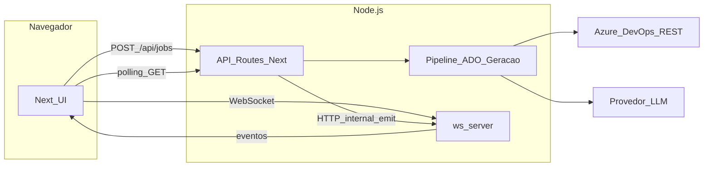

# Gerador de documentação QA (Azure DevOps)

Aplicação web para **gerar documentação estruturada para QA e desenvolvimento** a partir de uma **User Story** ou **Epic** no [Azure DevOps](https://azure.microsoft.com/products/devops). O QA informa o **link do work item** e um **Personal Access Token (PAT)** com permissão de leitura; o sistema consulta o ADO, processa anexos suportados, aplica **template e regras** e, opcionalmente, **enriquece com LLM**, entregando **preview paginado** e **download em ZIP** (Markdown + JSON).

Repositório: [github.com/vinileme/gerador_documentos-QA](https://github.com/vinileme/gerador_documentos-QA)

---

## Objetivo

Reduzir ambiguidade entre negócio, desenvolvimento e QA ao:

- Centralizar, em um único artefato, **resumo**, **escopo**, **regras e suposições**, **Gherkin sugerido**, **cenários de teste**, **negativos**, **borda**, **UI/UX**, **integração**, **riscos**, **perguntas ao PO** e **checklist**.
- Marcar claramente o que veio do ADO e o que é **inferência** (incluindo orientações para uso da palavra **(suposição)** quando a LLM estiver ativa).
- **Não persistir** o relatório nem o PAT no servidor após o processamento (fluxo orientado a **sessão** e **download local**).

---

## Principais funcionalidades

| Área | Descrição |
|------|-----------|
| **Entrada** | URL do work item (`dev.azure.com` ou `*.visualstudio.com`) + PAT (apenas no servidor). |
| **Tipos aceitos** | `User Story` e `Epic` (e variantes em PT configuráveis via ambiente). |
| **Campos lidos** | Título, descrição (HTML), critérios de aceite (campo configurável, padrão `Microsoft.VSTS.Common.AcceptanceCriteria`), relações de **anexos**. |
| **Anexos** | Extração de texto: **PDF**, **DOCX**, **XLSX**; outros formatos são listados como não suportados. |
| **Geração** | Camada **determinística** (template PT-BR) + **LLM opcional** (API compatível com OpenAI). |
| **Progresso** | Job assíncrono com eventos via **WebSocket**; **fallback por polling** em `GET /api/jobs/:jobId` se o WS não estiver disponível. |
| **Entrega** | Preview **paginado por seção** na UI; botão **Baixar ZIP** com `relatorio.md` e `relatorio.json`. |

---

## Stack tecnológica

- **Next.js 16** (App Router), **React 19**, **TypeScript**
- **Tailwind CSS v4** (via `@tailwindcss/postcss`)
- **Vitest** para testes unitários
- **ESLint** (`eslint-config-next`)
- **Zod** para validação do payload do relatório
- **pdf-parse** (classe `PDFParse`), **mammoth** (DOCX), **SheetJS xlsx** (planilhas)
- **ws**: servidor WebSocket dedicado (`ws-server/`) + cliente no browser
- **JSZip**: montagem do arquivo ZIP no cliente
- **tsx**: execução do processo `ws-server` em desenvolvimento/produção local

---

## Arquitetura (visão geral)



- **Next.js** executa a UI, as rotas `app/api/*` e o pipeline (leitura ADO, anexos, template, LLM).
- **ws-server** escuta na porta configurável (`WS_PORT`, padrão `3001`), recebe conexões do browser e recebe **eventos internos** do Next via `POST /internal/emit` (protegido por `JOB_INTERNAL_SECRET`).
- O **PAT** fica em memória no processo do Next, associado ao `jobId`, até o fim do job ou expiração por TTL.
- O **resultado do job** fica em memória (para o polling) com TTL separado; **não** há gravação em disco ou banco para histórico de relatórios.

---

## Pré-requisitos

- **Node.js** 20+ (recomendado; alinhado ao `engines` implícito do ecossistema Next).
- Conta e projeto no **Azure DevOps** com work items acessíveis.
- **PAT** com escopo mínimo de leitura de work items (ex.: *Work Items: Read* no escopo do projeto/organização).
- Opcional: chave de API para **LLM** compatível com OpenAI (`LLM_API_KEY` + `LLM_BASE_URL` + `LLM_MODEL`).

---

## Instalação

```bash
git clone https://github.com/vinileme/gerador_documentos-QA.git
cd gerador_documentos-QA
npm install
```

Copie as variáveis de ambiente:

```bash
cp .env.example .env.local
```

Edite `.env.local` conforme a tabela abaixo.

---

## Variáveis de ambiente

| Variável | Obrigatória | Descrição |
|----------|-------------|-----------|
| `WS_PORT` | Não | Porta do `ws-server` (padrão `3001`). |
| `JOB_INTERNAL_SECRET` | Recomendada em produção | Segredo compartilhado entre Next e `ws-server` para `POST /internal/emit`. |
| `WS_INTERNAL_BASE_URL` | Recomendada | URL base que o **servidor** Next usa para enviar eventos (ex.: `http://127.0.0.1:3001`). |
| `NEXT_PUBLIC_WS_URL` | Não | URL **WebSocket** vista pelo browser (ex.: `ws://127.0.0.1:3001`). Se vazia, o cliente tenta `ws(s)://<hostname>:3001`. |
| `LLM_API_KEY` | Não | Sem valor, o relatório usa só o template determinístico e um aviso em `meta.warnings`. |
| `LLM_BASE_URL` | Não | Padrão `https://api.openai.com/v1`. |
| `LLM_MODEL` | Não | Padrão `gpt-4o-mini`. |
| `ADO_API_VERSION` | Não | Padrão `7.1`. |
| `ACCEPTANCE_CRITERIA_FIELD` | Não | Referência do campo de AC no ADO (padrão `Microsoft.VSTS.Common.AcceptanceCriteria`). |
| `ALLOWED_WORK_ITEM_TYPES` | Não | Lista separada por vírgula dos nomes exatos de `System.WorkItemType` aceitos. |
| `MAX_ATTACHMENT_BYTES` | Não | Limite por anexo (padrão 15 MB). |
| `MAX_TOTAL_ATTACHMENT_BYTES` | Não | Limite somado dos anexos processados (padrão 40 MB). |
| `MAX_LLM_OUTPUT_CHARS` | Não | Truncagem de segurança da resposta LLM. |
| `JOB_PAT_TTL_MS` / `JOB_RESULT_TTL_MS` | Não | TTL do PAT e do resultado em memória (padrão 30 minutos). |

O arquivo [`.env.example`](.env.example) contém os mesmos comentários para consulta rápida.

---

## Como executar

### Desenvolvimento (Next + WebSocket)

Sube o app em `http://localhost:3000` (porta padrão do Next) e o **ws-server** na `WS_PORT`:

```bash
npm run dev
```

Comandos separados, se preferir dois terminais:

```bash
npm run dev:next
npm run dev:ws
```

### Produção (build + start)

```bash
npm run build
```

Para subir **Next** e **ws-server** juntos (ex.: máquina única):

```bash
npm run start:all
```

Ou apenas o Next (sem progresso em tempo real pelo WS, mas com **polling** ainda funcional):

```bash
npm start
```

---

## Uso da interface

1. Abra a página inicial (`/`).
2. Cole a **URL** do work item (formato `_workitems/edit/{id}`).
3. Informe o **PAT** (não é armazenado após o job; trafega só no `POST` para o servidor).
4. Clique em **Gerar documentação**.
5. Acompanhe o **progresso** (log na página + WebSocket quando disponível).
6. Navegue no **preview** com **Anterior** / **Próximo** (uma seção por página).
7. Baixe o **ZIP** com `relatorio.md` e `relatorio.json` antes de fechar a aba (o servidor **não** guarda o relatório para download posterior).

---

## API REST

| Método | Rota | Descrição |
|--------|------|-----------|
| `GET` | `/api/health` | Verificação simples de disponibilidade. |
| `POST` | `/api/jobs` | Inicia um job. Corpo JSON: `{ "workItemUrl": string, "personalAccessToken": string }`. Resposta: `{ "jobId", "pollUrl" }`. |
| `GET` | `/api/jobs/:jobId` | Consulta estado: `queued`, `running`, `done` (com `payload`) ou `error` (com `code` e `message`). |

Runtime das rotas de API: **Node.js** (`export const runtime = "nodejs"`).

---

## WebSocket (`ws-server`)

### Cliente → servidor

- **Inscrição:** `{ "type": "subscribe", "jobId": "<uuid>" }` após receber o `jobId` do `POST /api/jobs`.
- **Ping:** `{ "type": "ping" }` → resposta `{ "type": "pong" }`.

### Servidor → cliente (eventos retransmitidos a partir do `/internal/emit`)

- **Progresso:** `{ "type": "progress", "jobId", "stage", "message?", "percent?" }`
- **Conclusão:** `{ "type": "done", "jobId", "payload": <ReportPayload> }`
- **Erro:** `{ "type": "error", "jobId", "code", "message" }`
- **Confirmação de sala:** `{ "type": "subscribed", "jobId" }`

### Endpoint interno (somente servidor)

- `POST /internal/emit` com header `Authorization: Bearer <JOB_INTERNAL_SECRET>` e corpo JSON igual aos eventos acima.

---

## Contrato do relatório (`ReportPayload`)

O objeto validado por Zod inclui:

- **`version`**: literal `1`.
- **`structured`**: seções fixas em PT (`resumo`, `objetivoNegocio`, `escopo`, `foraEscopo`, `regras`, `suposicoes`, `gherkin`, `testesFuncionais`, `negativos`, `borda`, `uiux`, `integracao`, `riscos`, `perguntas`, `checklist`) — strings em Markdown simples.
- **`markdown`**: documento único derivado das seções (paridade lógica com o JSON para exportação).
- **`meta`**: `workItemId`, `workItemType`, `title`, `adoWebUrl?`, `generatedAt`, `warnings[]`.
- **`provenance`**: trechos/texto atribuído ao ADO (`fromAdo`) e notas sobre inferência (`inferredNotes`).

O ZIP gerado no cliente contém:

- `relatorio.json` — payload completo.
- `relatorio.md` — mesmo conteúdo que `payload.markdown`.

---

## Testes e qualidade

```bash
npm run lint
npm test
```

Testes incluem parse de URLs do ADO, regras de template e armazenamento em memória dos jobs.

---

## Estrutura de pastas (principal)

```
app/
  api/health/          # Health check
  api/jobs/            # POST cria job; GET/:jobId consulta resultado
  layout.tsx, page.tsx
components/
  GeradorClient.tsx    # Formulário, WS, polling, preview, ZIP
lib/
  ado/                 # Parse URL, REST, HTML→texto, anexos
  attachments/         # Extração PDF / DOCX / XLSX
  generation/          # Normalização, template, LLM, markdown, pipeline
  jobs/                # Job em memória + agendamento
  internal/ws-emit.ts # Ponte HTTP → ws-server
  schemas/             # Zod do payload
ws-server/
  index.ts             # HTTP + WebSocket
  handlers/types.ts    # Tipos de mensagens (documentação)
```

---

## Segurança e privacidade

- O **PAT** não deve ser commitado; use `.env.local` apenas para segredos do **servidor** da aplicação (LLM, `JOB_INTERNAL_SECRET`), não para o PAT do usuário final (este é enviado no corpo do `POST` por sessão).
- Trate o PAT como credencial sensível: HTTPS em produção, rotação periódica e escopo mínimo no Azure DevOps.
- O endpoint `/internal/emit` deve ficar **acessível só na rede interna** (ou localhost) em produção.
- Anexos e descrições podem conter **dados pessoais ou confidenciais**; o operador deve respeitar políticas da empresa ao usar LLM externa.

---

## Limitações e observações

- **Estado em memória:** reiniciar o processo do Next apaga jobs e resultados pendentes; múltiplas instâncias sem store compartilhado não compartilham jobs.
- **Deploy serverless puro:** jobs longos e WebSocket em processo separado podem exigir arquitetura alternativa (fila + worker + SSE/polling).
- **Tipos de work item:** os nomes vêm literalmente do ADO; se o processo usar outro rótulo, ajuste `ALLOWED_WORK_ITEM_TYPES`.
- **Campo de critérios de aceite:** processos customizados podem usar outro campo; ajuste `ACCEPTANCE_CRITERIA_FIELD`.
- **Dependência `xlsx`:** verifique avisos do `npm audit` em relação a vulnerabilidades conhecidas; avalie substituição ou pin de versão em ambientes restritivos.

---

## Scripts npm

| Script | Função |
|--------|--------|
| `npm run dev` | Next (dev) + `ws-server` em paralelo. |
| `npm run dev:next` / `npm run dev:ws` | Apenas um dos processos. |
| `npm run build` | Build de produção do Next. |
| `npm start` | Servidor Next (produção). |
| `npm run start:all` | Next + `ws-server` (ex.: porta 3000 + WS). |
| `npm run lint` | ESLint. |
| `npm test` / `npm run test:watch` | Vitest. |

---

## Licença

Este repositório é privado/pessoal conforme a configuração do GitHub do mantenedor. Ajuste esta seção se adotar uma licença explícita (MIT, Apache-2.0, etc.).
